# RED-GREEN-REVIEW 워크플로우 (Human-in-the-Loop TDD)

## 개요

테스트를 먼저 작성하라. 실패하는 것을 확인하라. 통과시킬 최소한의 코드를 작성하라. 단, GREEN 구현은 **사람 파트너의 리뷰를 거친 뒤에만** 커밋한다.

- RED 단계가 끝나면 커밋한다 (실패하는 테스트 = 목표의 스냅샷).
- GREEN 단계는 구현하고 테스트 통과만 확인하며, **아직 커밋하지 않는다**.
- REVIEW 단계에서 사람 파트너가 GREEN 코드를 검토하고 승인해야만 GREEN 커밋이 이루어진다.

**핵심 원칙:** 테스트가 실패하는 것을 직접 보지 않았다면, 그 테스트가 올바른 것을 검증하는지 알 수 없다. GREEN 코드는 사람이 검토하기 전까지 커밋되지 않는다.

**규칙의 문자(letter)를 어기는 것은 곧 규칙의 정신(spirit)을 어기는 것이다.**

## 사용 시점

**항상:**
- 새로운 기능
- 버그 수정
- 리팩터링
- 동작(behavior) 변경

**예외 (사람 파트너에게 물어볼 것):**
- 일회성 프로토타입
- 자동 생성된 코드
- 설정(configuration) 파일

"이번 한 번만 TDD를 건너뛸까?"라고 생각하고 있는가? 멈춰라. 그건 합리화다.

## 철의 법칙 (The Iron Law)

```
실패하는 테스트가 먼저 존재하지 않는 한, 프로덕션 코드를 작성하지 않는다
NO PRODUCTION CODE WITHOUT A FAILING TEST FIRST

GREEN 코드는 사람 파트너의 리뷰 없이 커밋하지 않는다
NO GREEN COMMIT WITHOUT HUMAN REVIEW FIRST
```

테스트보다 먼저 코드를 작성했다면? 삭제하라. 처음부터 다시 시작하라.

**예외 없음:**
- "참고용"으로 남겨두지 말 것
- 테스트를 쓰면서 그 코드를 "각색(adapt)"하지 말 것
- 그 코드를 쳐다보지도 말 것
- 삭제는 진짜 삭제를 의미한다
- 리뷰를 생략하고 GREEN을 커밋하지 말 것

테스트로부터 새롭게(fresh) 구현하라. 그게 전부다.

## Red-Green-Review 사이클

```dot
digraph tdd_cycle {
    rankdir=LR;
    plan [label="계획\nPlan.md 생성/검토", shape=box, style=filled, fillcolor="#eeeeee"];
    red [label="RED\n실패하는 테스트 작성", shape=box, style=filled, fillcolor="#ffcccc"];
    verify_red [label="제대로\n실패하는지 확인", shape=diamond];
    commit_red [label="COMMIT\nRED", shape=box, style=filled, fillcolor="#ffe0e0"];
    green [label="GREEN\n최소한의 코드", shape=box, style=filled, fillcolor="#ccffcc"];
    verify_green [label="통과 확인\n전체 그린", shape=diamond];
    review [label="REVIEW\n사람 파트너 검토", shape=box, style=filled, fillcolor="#ccccff"];
    approved [label="승인?", shape=diamond];
    commit_green [label="COMMIT\nGREEN", shape=box, style=filled, fillcolor="#e0e0ff"];
    next [label="다음 목표", shape=ellipse];

    plan -> red;
    red -> verify_red;
    verify_red -> commit_red [label="예"];
    verify_red -> red [label="잘못된\n실패"];
    commit_red -> green;
    green -> verify_green;
    verify_green -> review [label="예"];
    verify_green -> green [label="아니오"];
    review -> approved;
    approved -> green [label="리팩토링\n요청"];
    approved -> commit_green [label="승인"];
    commit_green -> next;
    next -> plan;
}
```



### 계획 - 목표 설정과 Plan.md

이번 사이클에서 달성할 목표(goal)를 정확히 설정한다 — 애매하면 사람 파트너에게 먼저 질문한다. `Plan.md` 생성을 요청하고, 사람 파트너와 함께 검토한다. Plan에 없는 범위를 미리 끌어들이지 않는다.

### RED - 실패하는 테스트 작성

무엇이 일어나야 하는지를 보여주는 최소한의 테스트 한 개를 작성하라.

<Good>
```python
def test_retries_failed_operations_3_times():
    attempts = 0

    def operation():
        nonlocal attempts
        attempts += 1
        if attempts < 3:
            raise RuntimeError("fail")
        return "success"

    result = retry_operation(operation)

    assert result == "success"
    assert attempts == 3
```
명확한 이름, 실제 동작 검증, 한 가지만 검증
</Good>

<Bad>
```python
def test_retry_works(mocker):
    mock = mocker.Mock(side_effect=[RuntimeError(), RuntimeError(), "success"])
    retry_operation(mock)
    assert mock.call_count == 3
```
모호한 이름, 실제 코드가 아닌 mock을 검증
</Bad>

**요건:**
- 하나의 동작(behavior)
- 명확한 이름
- 실제 코드 (불가피한 경우가 아니면 mock 사용 금지)

### RED 검증 - 실패하는 것을 직접 보기

**필수. 절대 건너뛰지 말 것.**

```bash
pytest path/to/test_file.py
```

다음을 확인하라:
- 테스트가 실패한다 (에러가 아니라)
- 실패 메시지가 예상한 그대로다
- 기능이 없어서 실패한다 (오타 때문이 아니라)
- Plan.md가 이번 사이클의 목표를 명확히 기술하고 있다

**테스트가 통과한다고?** 이미 존재하는 동작을 검증하고 있는 것이다. 테스트를 고쳐라.

**테스트가 에러를 낸다고?** 에러를 고치고, 제대로 실패할 때까지 다시 실행하라.

### RED 커밋

위 조건을 모두 만족하면 RED 커밋을 남긴다 (실패하는 테스트 + Plan.md 갱신 내용). 프로덕션 코드는 포함하지 않는다.

```bash
git add <plan> <test files>
git commit -m "RED: <이번 사이클 목표> 실패하는 테스트 추가"
```

### GREEN - 최소한의 코드

테스트를 통과시키는 가장 단순한 코드를 작성하라. RED에서 설정한 목표, 즉 Plan.md의 범위를 벗어나지 않는다.

<Good>
```python
def retry_operation(fn):
    for i in range(3):
        try:
            return fn()
        except Exception as e:
            if i == 2:
                raise
    raise RuntimeError("unreachable")
```
통과시킬 만큼만
</Good>

<Bad>
```python
def retry_operation(
    fn,
    max_retries=3,
    backoff="linear",  # "linear" | "exponential"
    on_retry=None,
):
    # YAGNI (You Aren't Gonna Need It)
    ...
```
과도한 설계
</Bad>

기능을 추가하지 말고, 다른 코드를 리팩터링하지 말고, 테스트가 요구하는 것 이상으로 "개선"하지 말라.

### GREEN 검증 - 통과하는 것을 직접 보기

**필수.**

```bash
pytest path/to/test_file.py
```

다음을 확인하라:
- 테스트가 통과한다
- 다른 테스트들도 여전히 통과한다
- 출력이 깨끗하다 (에러, 경고 없음)

**테스트가 실패한다?** 테스트가 아니라 코드를 고쳐라.

**다른 테스트가 실패한다?** 지금 당장 고쳐라.

**이 시점에는 아직 커밋하지 않는다.** GREEN은 REVIEW를 통과한 뒤에만 커밋된다.

### REVIEW - 사람 파트너 검토 (Human-in-the-Loop)

GREEN 구현이 끝나면 사람 파트너의 리뷰를 요청한다. 리뷰 없이 임의로 진행하지 않는다.

**리뷰 시 확인할 것:**
- Plan.md에 없는 사항이 구현되지는 않았는지 (스코프 크리프)
- 과도한 설계(YAGNI 위반)나 불필요한 추상화가 없는지
- 테스트가 실제 동작을 검증하는지, mock 남용은 없는지 (필요시 @testing-anti-patterns.md 참고)
- 리팩토링이 필요한 부분이 있는지 — 있다면 사람 파트너에게 리팩토링 요청 사항을 명시적으로 물어본다

**리뷰 결과에 따른 분기:**
- **리팩토링 요청이 있으면:** 요청 사항을 반영하고, 테스트가 여전히 그린인지 다시 확인한 뒤 다시 리뷰를 요청한다. (테스트를 그린으로 유지한 채로만 리팩터링한다.)
- **승인되면:** GREEN 커밋을 남긴다.

```bash
git add <production code>
git commit -m "GREEN: <이번 사이클 목표> 구현 (리뷰 완료)"
```

**리뷰를 생략하고 GREEN을 커밋하지 말 것.** 이것이 이 스킬의 핵심 게이트다.

### 반복

다음 기능에 대한 다음 목표로 계획 단계부터 다시 시작한다.

## 좋은 테스트

| 품질 | 좋음 | 나쁨 |
|------|------|------|
| **최소성** | 한 가지만 검증. 이름에 "and"가 들어가는가? 분리하라. | `test_validates_email_and_domain_and_whitespace` |
| **명확성** | 이름이 동작을 설명한다 | `test_test1` |
| **의도 표현** | 원하는 API를 보여준다 | 코드가 무엇을 해야 하는지 가린다 |

## 왜 순서가 중요한가

**"코드를 먼저 짜고 나중에 테스트로 검증할게요"**

코드 이후에 작성된 테스트는 즉시 통과한다. 즉시 통과한다는 것은 아무것도 증명하지 못한다:
- 잘못된 것을 검증하고 있을 수 있다
- 동작이 아니라 구현(implementation)을 검증하고 있을 수 있다
- 잊어버린 엣지 케이스를 놓쳤을 수 있다
- 그 테스트가 버그를 잡는 것을 한 번도 보지 못했다

테스트 우선(test-first)은 테스트가 실패하는 것을 강제로 보게 함으로써, 그 테스트가 실제로 무언가를 검증하고 있음을 증명한다.

**"이미 모든 엣지 케이스를 수동으로 테스트했어요"**

수동 테스트는 임시방편(ad-hoc)이다. 모든 것을 테스트했다고 생각하지만:
- 무엇을 테스트했는지 기록이 없다
- 코드가 변경될 때 다시 실행할 수 없다
- 압박 상황에서 케이스를 잊기 쉽다
- "내가 해봤을 때는 됐어요" ≠ 포괄적

자동화된 테스트는 체계적이다. 매번 동일한 방식으로 실행된다.

**"X시간 작업한 걸 지우는 건 낭비예요"**

매몰비용(sunk cost) 오류다. 시간은 이미 지나갔다. 지금 당신의 선택지는:
- 삭제하고 TDD로 다시 작성 (X시간 더, 높은 확신)
- 그대로 두고 나중에 테스트 추가 (30분, 낮은 확신, 버그 가능성 큼)

진짜 "낭비"는 신뢰할 수 없는 코드를 유지하는 것이다. 진짜 테스트가 없는 동작 코드는 기술 부채다.

**"TDD는 교조적이에요. 실용적이라는 건 상황에 맞게 조정하는 것"**

TDD가 바로 실용적이다:
- 커밋 전에 버그를 발견 (나중에 디버깅하는 것보다 빠름)
- 회귀(regression) 방지 (테스트가 깨짐을 즉시 잡아냄)
- 동작을 문서화 (테스트가 코드 사용법을 보여줌)
- 자유로운 리팩터링 가능 (마음껏 바꿔도 테스트가 깨짐을 잡음)

"실용적"이라는 이름의 지름길 = 프로덕션에서의 디버깅 = 더 느리다.

**"테스트를 나중에 써도 같은 목표를 달성해요 - 정신이 중요하지 의식이 중요한 게 아니에요"**

아니다. 사후(after) 테스트는 "이 코드가 무엇을 하는가?"에 답한다. 사전(first) 테스트는 "이 코드가 무엇을 해야 하는가?"에 답한다.

사후 테스트는 당신의 구현에 편향(bias)되어 있다. 요구되는 것이 아니라 당신이 만든 것을 검증한다. 발견된 엣지 케이스가 아니라 당신이 기억하는 엣지 케이스를 검증한다.

사전 테스트는 구현 전에 엣지 케이스 발견을 강제한다. 사후 테스트는 당신이 모든 것을 기억했는지 검증한다 (당신은 기억하지 못했다).

사후에 30분 동안 테스트를 쓰는 것 ≠ TDD. 커버리지는 얻지만, 테스트가 작동한다는 증명은 잃는다.

## 흔한 합리화들

| 변명 | 현실 |
|------|------|
| "너무 단순해서 테스트할 게 없어요" | 단순한 코드도 깨진다. 테스트는 30초면 쓴다. |
| "나중에 테스트할게요" | 즉시 통과하는 테스트는 아무것도 증명하지 않는다. |
| "사후 테스트도 같은 목표 달성" | 사후 = "무엇을 하는가?" 사전 = "무엇을 해야 하는가?" |
| "이미 수동으로 테스트했어요" | 임시방편 ≠ 체계적. 기록 없음, 재실행 불가. |
| "X시간 작업 지우는 건 낭비" | 매몰비용 오류. 미검증 코드 유지가 기술 부채. |
| "참고용으로 두고 테스트부터" | 결국 그 코드를 각색하게 된다. 그게 사후 테스트다. 삭제는 진짜 삭제다. |
| "먼저 탐색(explore)이 필요해요" | 좋다. 탐색물은 버리고, TDD로 시작하라. |
| "테스트가 어렵다는 건 설계가 불명확하다는 뜻" | 테스트의 말을 들어라. 테스트하기 어려우면 사용하기도 어렵다. |
| "TDD는 나를 느리게 해요" | TDD가 디버깅보다 빠르다. 실용적 = 테스트 우선. |
| "수동 테스트가 더 빨라요" | 수동은 엣지 케이스를 증명하지 못한다. 매번 다시 테스트해야 한다. |
| "기존 코드엔 테스트가 없어요" | 당신이 그 코드를 개선하는 중이다. 기존 코드에 대한 테스트도 추가하라. |
| "리뷰는 생략하고 바로 커밋할게요" | 리뷰 없는 GREEN 커밋은 스코프 크리프와 과도한 설계를 놓친다. |

## 위험 신호 (Red Flags) - 멈추고 처음부터

- 테스트보다 코드가 먼저 있다
- 구현 후에 테스트를 쓴다
- 테스트가 즉시 통과한다
- 왜 테스트가 실패했는지 설명할 수 없다
- 테스트를 "나중에" 추가한다
- "이번 한 번만"이라고 합리화한다
- "이미 수동으로 테스트했어요"
- "사후 테스트도 같은 목적을 달성해요"
- "정신이 중요하지 의식이 중요한 게 아니에요"
- "참고용으로 두고" 또는 "기존 코드 각색"
- "이미 X시간 썼는데, 지우는 건 낭비"
- "TDD는 교조적, 나는 실용적"
- "이건 다른 경우인데..."
- Plan.md 없이 RED를 시작한다
- RED 실패를 직접 확인하지 않고 커밋한다
- GREEN 구현물을 사람 리뷰 없이 바로 커밋한다
- 리뷰에서 지적된 리팩토링을 반영하지 않고 넘어간다
- 한 커밋에 RED와 GREEN이 섞여 있다 (두 커밋으로 분리되어야 한다)

**이 모든 것은 다음을 의미한다: 코드를 삭제하라. TDD로 다시 시작하라.**

## 예시: 버그 수정

**버그:** 빈 이메일이 허용됨

**RED**
```python
def test_rejects_empty_email():
    result = submit_form({"email": ""})
    assert result["error"] == "Email required"
```

**RED 검증**
```bash
$ pytest
FAILED: KeyError: 'error'   (또는 'Email required'를 기대했으나 다른 값)
```

**RED 커밋**
```bash
$ git commit -m "RED: 빈 이메일 거부 실패하는 테스트 추가"
```

**GREEN**
```python
def submit_form(data):
    email = data.get("email", "")
    if not email.strip():
        return {"error": "Email required"}
    # ...
```

**GREEN 검증**
```bash
$ pytest
PASSED
```

**REVIEW**
사람 파트너에게 리뷰 요청 → 승인

**GREEN 커밋**
```bash
$ git commit -m "GREEN: 빈 이메일 거부 구현 (리뷰 완료)"
```

**REFACTOR**
여러 필드에 대한 검증이 필요해지면 검증 로직을 추출하라. (테스트는 그린 유지, 새 리뷰 후 커밋)

## 검증 체크리스트

작업을 완료(complete)로 표시하기 전에:

- [ ] 모든 새 함수/메서드에 테스트가 있다
- [ ] 각 테스트가 실패하는 것을 직접 보고 구현했다
- [ ] 각 테스트가 예상한 이유로 실패했다 (오타가 아니라 기능 부재로)
- [ ] RED 커밋이 남아 있다 (실패하는 테스트 + Plan.md)
- [ ] 각 테스트를 통과시키는 최소한의 코드를 작성했다
- [ ] 모든 테스트가 통과한다
- [ ] 출력이 깨끗하다 (에러, 경고 없음)
- [ ] 테스트가 실제 코드를 사용한다 (mock은 불가피할 때만)
- [ ] 엣지 케이스와 에러 케이스가 커버되어 있다
- [ ] GREEN 코드가 사람 파트너의 리뷰를 거쳤다
- [ ] GREEN 커밋이 리뷰 승인 이후에 이루어졌다

체크박스를 모두 채울 수 없다면? TDD를 건너뛴 것이다. 처음부터 다시 시작하라.

## 막혔을 때

| 문제 | 해결 |
|------|------|
| 어떻게 테스트할지 모르겠다 | 원하는 API를 먼저 적어보라. assertion부터 작성하라. 사람 파트너에게 물어보라. |
| 테스트가 너무 복잡하다 | 설계가 너무 복잡하다. 인터페이스를 단순화하라. |
| 모든 것을 mock해야 한다 | 코드가 너무 결합(coupled)되어 있다. 의존성 주입(DI)을 사용하라. |
| 테스트 셋업이 거대하다 | 헬퍼를 추출하라. 그래도 복잡하면 설계를 단순화하라. |
| 리뷰에서 계속 리팩토링이 나온다 | 다음 GREEN을 시도하기 전에 설계를 사람 파트너와 다시 논의하라. |

## 디버깅 통합

버그를 발견했는가? 그 버그를 재현하는 실패하는 테스트를 먼저 작성하라. TDD 사이클을 따르라. 그 테스트가 수정을 증명하고 회귀를 방지한다.

테스트 없이 버그를 수정하지 말라.

## 테스트 안티패턴

mock이나 테스트 유틸리티를 추가할 때, @testing-anti-patterns.md 를 읽어 흔한 함정을 피하라:
- 실제 동작 대신 mock 동작을 테스트하기
- 프로덕션 클래스에 테스트 전용 메서드를 추가하기
- 의존성을 이해하지 못한 채 mock하기

## pytest 관련 추가 팁 (Python 특화)

### 픽스처(Fixtures)는 절제해서 사용하라

```python
# 좋음: 분명히 재사용되는 셋업만 픽스처로
@pytest.fixture
def temp_db():
    db = create_in_memory_db()
    yield db
    db.close()

def test_user_creation(temp_db):
    user = create_user(temp_db, name="Alice")
    assert user.id is not None
```

픽스처가 너무 많아지면 테스트의 의도가 흐려진다. 단순한 셋업은 테스트 안에 그대로 두는 편이 명확할 때가 많다.

### parametrize는 같은 동작의 여러 입력에만 사용하라

```python
# 좋음: 같은 동작 규칙, 여러 입력
@pytest.mark.parametrize("email", ["", "   ", "\t\n"])
def test_rejects_blank_email(email):
    result = submit_form({"email": email})
    assert result["error"] == "Email required"
```

서로 다른 동작을 parametrize로 묶지 말라. 그건 테스트 한 개가 아니라 여러 개로 나뉘어야 한다.

### mock은 외부 경계에서만

`unittest.mock` 또는 `pytest-mock`의 `mocker`를 쓸 때는, 우리가 제어할 수 없는 경계(네트워크, 파일시스템, 시간 등)에서만 사용하라. 우리 코드 내부 모듈 사이의 호출을 mock하기 시작했다면, 결합도가 너무 높다는 신호다.

### 테스트 실행 명령

```bash
# 단일 파일
pytest path/to/test_file.py

# 단일 테스트
pytest path/to/test_file.py::test_specific_case

# 첫 실패에서 멈춤 (빠른 RED 확인용)
pytest -x

# 자세한 출력
pytest -v

# 출력(print) 캡처 끔 (디버깅용)
pytest -s
```

## 최종 규칙

```
프로덕션 코드 → 테스트가 존재하고, 먼저 실패했다
GREEN 커밋 → 사람 파트너의 리뷰를 거쳤다
그 외 → TDD가 아니다
```

사람 파트너의 허가 없이는 예외 없음.
