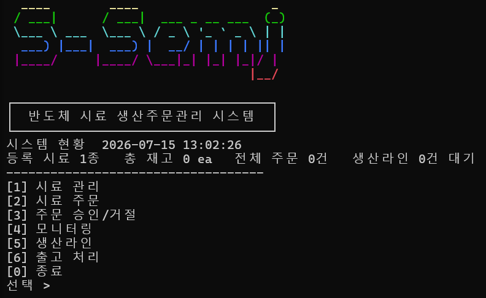

# SampleOrderSystem — 반도체 시료 생산주문관리 시스템

반도체 샘플(시료) 생산 주문을 등록·승인·생산·출고까지 관리하는 콘솔 애플리케이션. 기능 요구사항·도메인 규칙·시나리오는 [`PRD.md`](./PRD.md), 개발 방법론(오케스트레이션)은 [`CLAUDE.md`](./CLAUDE.md), 구현 진행 이력은 [`plan/`](./plan) 참고.



## 실행 방법

```bash
python main.py
```

프로젝트 루트(`SampleOrderSystem/`)에서 실행하면 된다. `main.py`가 `src/`를 자동으로 `sys.path`에 추가하므로 별도 `PYTHONPATH` 설정은 필요 없다.

## 메뉴 흐름

```
[1] 시료 관리      — 시료 등록(평균생산시간은 분 단위 숫자, 정수/소수 모두 허용) / 조회(재고 포함) / 이름 검색
[2] 시료 주문      — 등록된 시료 목록을 먼저 보여준 뒤 시료ID/고객명/수량 입력 → RESERVED 주문 생성
[3] 주문 승인/거절 — RESERVED 목록을 번호로 보여주고, 번호 선택 후 [1]승인/[2]거절/[0]취소 결정
[4] 모니터링      — 상태별 주문 수 집계, 시료별 재고 현황(여유/부족/고갈)
[5] 생산라인      — 대기 중인 생산 작업(FIFO), 진행률 바 + 예상 완료 시각 표시, 생산 완료 처리
[6] 출고 처리      — CONFIRMED 목록을 번호로 선택 → RELEASE 전환, 주문번호/수량/처리일시/상태전이 상세 표시
[0] 종료
```

주문 상태 전이: `RESERVED → (승인) → CONFIRMED | PRODUCING → (생산 완료) → CONFIRMED → (출고) → RELEASE`, `RESERVED → (거절) → REJECTED`.

주문번호는 `ORD-YYYYMMDD-NNNN` 형식(예: `ORD-20260416-0043`)으로 자동 생성된다.

### UI 부가 기능

- 화면 전환마다 `====` 구분선으로 섹션을 나눠 표시 (완전 clear 대신, 직전 완료 메시지가 사라지지 않도록).
- 주문/출고 대상 목록이 10건을 넘으면 `[N] 다음 페이지` / `[P] 이전 페이지`로 넘겨볼 수 있다 (10건 이하는 그대로 전체 표시).
- 메인 메뉴에 ASCII 로고와 "시스템 현황"(등록 시료 수 / 총 재고 / 전체 주문 수 / 생산라인 대기 건수)을 표시.
- 상태 값(RESERVED/CONFIRMED/PRODUCING/REJECTED/RELEASE, 여유/부족/고갈)에 ANSI 색상 배지 적용 (터미널에 따라 렌더링 여부가 다를 수 있음 — 하단 "알려진 제약" 참고).

## 프로젝트 구조

```
SampleOrderSystem/
  main.py                 진입점
  src/
    model/                도메인 로직 (Sample, Order, ProductionLine, monitoring 함수) — 콘솔 의존성 없음
    controller/            Model과 View를 연결하는 흐름 제어
    view/                  콘솔 입출력 (ConsoleView) 전담
  tests/                  pytest 테스트 (model, controller)
  plan/                   TDD 사이클별 계획 문서 (전체플랜.md, plan_1.md~)
  reports/                서브에이전트(doc-checker/bug-hunter) 리뷰 리포트
  docs/                   원본 과제 요구사항 (PDF, 페이지 이미지, 설명.md)
  CLAUDE.md               개발 방법론(오케스트레이션) — 요구사항은 다루지 않음
  PRD.md                  제품 요구사항 문서 (기능 명세, 도메인 규칙, 수율 계산 예시 등)
```

## 테스트

```bash
python -m pytest -v
```

도메인 로직(`src/model`)과 Controller 오케스트레이션(`src/controller`)은 pytest로 자동 검증한다. 실제 콘솔 입출력(`ConsoleView`, `main.py` 전체 실행)은 `input()`/`print()`가 외부 경계라는 판단 아래 자동화 테스트 대상에서 제외하고, 매 사이클마다 수동 스모크 테스트로 확인했다 (자세한 내용은 `.claude/skills/tdd/SKILL.md`, `plan/plan_11.md` 참고).

## 개발 방법론

이 프로젝트는 TDD Red-Green-Review 사이클(`.claude/skills/tdd/SKILL.md`)과 Agentic Engineering 5원칙(문서 관리 / 하네스 / Test / Clean Code / Commit 이력, `CLAUDE.md` 참고)에 따라 개발되었다. 커밋 이력 자체가 각 기능의 계획→실패→구현→리뷰→통과 과정을 보여준다.

## 알려진 제약

- 콘솔 상태 배지에 ANSI 색상 코드를 적용했으나(`src/view/colors.py`), 일부 Windows 터미널 환경에서 색상이 렌더링되지 않을 수 있다. 색상이 보이지 않아도 텍스트 자체는 정상 출력된다.
